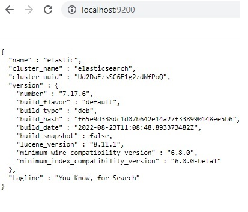
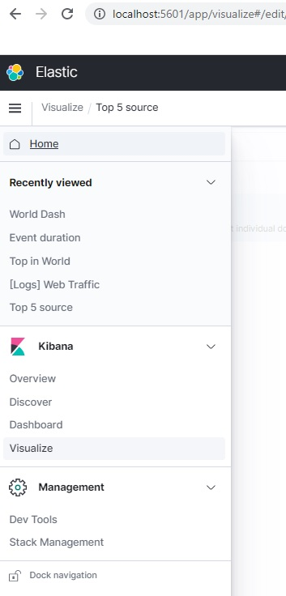
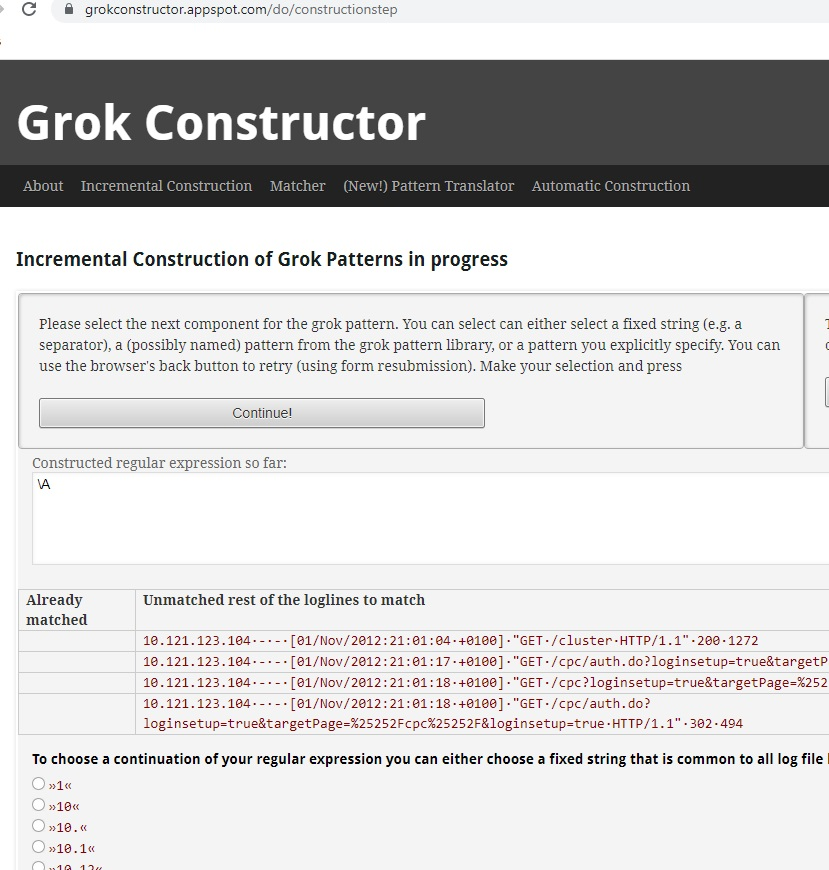

### Log Metrics ELK stack
Learn ElasticSearch, Logstash, FileBeats, MetricBeats, Kibana using a Vagrant box



Elasticsearch can manage just about any kind of data, not just log files. In this learning, we're going to focus on that log file use case. So the primary audience is anyone who needs to work with a lot of log data, that's people like Dev0ps engineers, system administrators, security engineers and full-stack developers. Even if that doesn't describe your current role, you may still find a lot of value in how the Elastic Stack applies to that use case.

The Elastic Stack lets you avoid that frantic search and immediately get started on troubleshooting the issue. You can just go to one central place and immediately find where the problem is, and then solve that immediate issue in place. It also means that you can quickly cross reference logs in order to fix the underlying bug that caused the issue in the first place. Kibana is the visualization and search front end for the stack, it gives you a way to search through logs and apply preset filters. For example, looking for the keyword error like in the screenshot, that's handy and could save a lot of trouble. But looking at a wall of text, it can be hard to see pattern. For me one of the best parts of Kibana is that it lets you visualize that data in real time. That means you can notice potential issues at a glance. For example, we might start by looking through the messages associated with this big spike in errors before looking through this sequential list of all error logs. The Elastic Stack can be used for more than logs, anyone who needs to handle a lot of data and be able to index and search that data could use it. That could be medical researchers working with DNA sequencing, or a web app that needs a back end to power at search box. We're going to focus on logs in this course, since that's the most common use for this tool, and it's easier to demonstrate. The stack doesn't really care what your data is. So even if you use it for logs, you may find that you have another use case other than just handling those.

Beats are a lightweight way of getting data into the ELK Stack. They're individual packages written in Go that are focused on a single type of data. For example, Filebeat is a lightweight tool for shipping file-based logs from your various systems into the stack. Packetbeat is another that's used for ingesting network data. There are several more official Beats written and maintained by Elastic, and there are tons more community Beats, which are written and maintained by the open source community. You can even write your own Beat if you can't find what you're looking for in the official or community-maintained options. Before there were Beats, there was just Logstash. But Logstash does more than just ingest data. Its main purpose is for transforming data as it's coming in. For example, transforming plain text log lines into structured data objects. That structured data object is what gets stashed in your stack rather than just the raw text. It's a bit like cutting up carrots as soon as you get home from the store and putting 'em right in the fridge rather than waiting until right before you're ready to cook. Beats are lightweight, single-purpose tools. They might do exactly what you need or something close enough, like this tool for making spirals out of carrots. 

Logstash is like the big, heavy food processor in our metaphor. It's more work to deal with, but you get exactly what you want. Logstash is fairly resource-intensive, but you don't have to choose between Beats and Logstash. You can use Beats for the initial shipping of data to a central Logstash server that then handles the processing. Elasticsearch is the part of the stack that stores things. It holds all of the data itself. It's also the part of the stack that holds the index of the data for quick searching and for managing it around the cluster. A single Elasticsearch cluster can store more than one index so unrelated data can be kept separate for efficiency. In production use, Elasticsearch is generally deployed as a cluster. It does this by splitting up the data and indexes into one or more shards that are then physically distributed across the cluster. In this illustration, we've got shards A, B, and C. All of the shards have a redundant copy, but the individual servers each have different shards. When a server is removed, either intentionally or not, the data will still be available in the cluster, and the cluster can keep functioning in a degraded state while it tries to restore the redundant copies. Or in this case where a server is replaced, it will restore the data to that server. Of course, if all of the redundant copies of a shard are lost, the cluster won't be able to automatically recover, and the data will need to be restored manually. 

Kibana is the part of the stack that lets you easily get to your data and work with it. It's the web front end to Elastic Stack. You can do ad hoc searching, create visualizations, and a lot more. Kibana lets you define preset dashboards for combining multiple visualizations, text searches, or both on one screen. This is really handy for getting a quick bird's eye view across your infrastructure, like watching web traffic, error logs, and long-running database queries all in one place.


Tools needed
* VirtualBox
* Vagrant from HashiCorp
* Git for Windows for Git Bash

##### Unzip the files and go inside the folder

```
$ vagrant up (bunch of scripts for behind the scenes setup)

$ vagrant ssh

$ sudo su -
```

##### Copy/paste document for setting up your learning sandbox
```
$ wget -qO - https://artifacts.elastic.co/GPG-KEY-elasticsearch | apt-key add -

Setup the repository
$ echo "deb https://artifacts.elastic.co/packages/oss-7.x/apt stable main" | sudo tee -a /etc/apt/sources.list.d/elastic-7.x.list

Update app and install elastic search
$ apt-get update && apt-get install elasticsearch-oss
```

##### Enable ElasticSearch on start
```
$ systemctl enable elasticsearch
```

##### Start ElasticSearch on start
```
$systemctl start elasticsearch.service
```
##### Check if ElasticSearch is running
```
$ curl localhost:9200/?pretty
```

##### Kibana


```
$ apt-get update && apt-get install kibana-oss

$ systemctl enable kibana

$ systemctl start kibana.service
```
##### Show the logs from the service under systemd
```
$ journalctl -u kibana
```

- To access the service from browser, we need to change the server host
```
$ vim /etc/kibana/kibana.yml ( you can also change the port here)
server.host: "0"
```
Restart the service for the changes to take effect
```
$ systemctl restart kibana.service
```

To check if kibana is running
```
$ netstat -tulpn
```
To check the kibana service on the web browser, go to
http://localhost:5601/

##### To explore the kibana interface 

Try the sample data and try sample web logs

Left menu > Discover (try the inteface)


##### Configuring logstash
Expects java to be installed

- To install logstash we need java installed
```
$ apt-get update && apt-get install openjdk-11-jre
```

- Now we install logstash
```
$ apt-get install logstash-oss
```

- Now we need to set java home variable
```
vim /etc/default/logstash
JAVA_HOME="/usr/lib/jvm/java-11-openjdk-amd64"
```

- Enable service and start
```
$ systemctl enable logstash
$ systemctl start logstash.service
$ systemctl status logstash.service
```
```
cd /var/log/
** Do not use syslog as it will run into endless loops
** May be try kern.log

$ cp /vagrant/kern.conf /etc/logstash/conf.d/kern.conf

$ vim /etc/logstash/conf.d/kern.conf
```

To give read access to kern.log for all users so we could read from the logs
```
$ chmod a+r /var/log/kern.log
$ systemctl restart logstash
$ systemctl status logstash
```

In Kibana dashboard, go to three lines in top left, Stack management >> Index patterns and create the desired pattern
```
$ systemctl stop elasticsearch

$ cat /var/log/logstash/logstash-deprecation.log

$ /usr/share/logstash/bin/logstash --version

$ /usr/share/logstash/bin/logstash-plugin install logstash-input-beats

$ /usr/share/logstash/bin/logstash -e 'input { stdin { } } output { stdout {} }'
```
ctrl + D - exit logstash

```
/usr/share/logstash/bin/logstash -e 'input { stdin { } } output { stdout { codec => rubydebug } }'

/usr/share/logstash/bin/logstash  -e 'input { stdin { } } output { elasticsearch { hosts => localhost } }'

/usr/share/logstash/bin/logstash --config.test_and_exit -f /etc/logstash/conf.d/kern.conf
```

We can start Logstash with the following command:
```
$ /usr/share/logstash/bin/logstash -f /etc/logstash/conf.d/pipeline.conf
```

Newer versions of Logstash will check if you are using an Elasticsearch distributed by Elastic, using the basic free license or one of the paid tiers, the OSS version does not have the _license endpoint, so Logstash will not work.

https://www.elastic.co/guide/en/logstash/7.17/installing-logstash.html#_apt


##### Logstash comes with a ton of plugins. you can list the plugins with the following command
> ./usr/share/logstash/bin/logstash-plugin list


##### Sample logstash
```
input { stdin {} }

filter {
  { mutate {
      add_field => { "greeting" => "Hello %{message}" }
  }
}

output { stdout {} }
```
##### Grok constructor
To absorb or understand completely. Plugin for parsing unstructured data into structured data
```
filter {
  grok {
     match => {
	"message" => "%{IP:client} ......."
     }
  }
 }
```
##### Mutate plugin (for transforming the data and operate on the results)

https://grokconstructor.appspot.com/do/construction?example=2

##### Grok is a log parser



```
$ cd /vagrant
$ cp interactive.conf interactive.txt
Running logstash from commandline
$ /usr/share/logstash/bin/logstash -f interactive.conf
```
(successfully started logstash message comes up. now you can copy and paste few of the log messages from the file to playaround with input. you can also change the filter and playaround with it)

1598405565.206    301 127.0.0.1 TCP_TUNNEL/200 95784 CONNECT www.linkedin.com:443 - HIER_DIRECT/13.107.42.14 -

1598405565.206    301 127.0.0.1 TCP_TUNNEL/200 95784 CONNECT www.linkedin.com:443 application/json HIER_DIRECT/13.107.42.14 -

1598405565.206    301 127.0.0.1 TCP_TUNNEL/200 95784 CONNECT www.linkedin.com:443 application/json HIER_DIRECT/13.107.42.14 sanjay

##### Beats
- Heartbeat (uptime, monitoring. it runs centrally and monitors other services)
- Filebeat (logs and text data)
- Metricbeat (shipping system metrics)
- Packetbeat (network data)
- Winlogbeat (windows event logs)
- Auditbeat (audit logs and data)
- Functionbeat (serverless data)

* Logstash uses JRuby, JVM and uses 1 GB memory
* Beats are written in Go and is lightweight. 
* Heartbeat is different from other beats that it is setup for monitoring from central. Other beats ships data to elasticsearch.


When you first started up your Vagrant box, the Vagrant file configured a lightweight virtual environment built on a tool called LXD. This is there to simulate an external web server. Let me run a command here lxc list. This is the virtual environment I'm talking about. Its name is web and it has its own IP address here. If you've worked with Docker, you might be surprised to learn that Docker was created as an alternative interface to the same backend that this tool uses which is called Linux containers or lxc. So the virtual environments we're working with are essentially the same as Docker containers. For our purposes LXD is a better fit because the container acts a bit more like a full virtual machine. 

So here we have a node called web, and in order to simulate, make this feel a little bit more like a real multi-node system, I've got a script called sandbox-ssh. And this will just connect us to our web node. So you can see the command prompt here changed from elastic to web. So now we're logged into this web node. And so I can say, look at the IP address. You see it's only got one interface, and this is it and it matches the IP on our main server here. If I quit out of here and I run IPA on the root box you see it's got a different IP, it's got other things set up. Let me clear the screen again. Now I'm going to ssh back into that web node, and as part of the setup, it also installed the engine X web server. So I'll run systemctl status nginx. And here you see that service is running. Now I've written a couple of scripts and change the config a little bit, so that we can actually generate some realistic looking logs on this machine. So there's a little script called webtest, and it's built on a tool called siege, which is what this message here is. And if you just run webtest, you can then look at the logs. Let me clear a screen. I'll say tail/var/log/nginx/ and then we'll look at the access log. Now this fakes out some IP addresses, and gives us all these different log lines. And you can run this as many times as you want. So we can run webtest should just take a second. And if we look at the end of the log this time, you see it now it's got different IPs and it's accessed different URLs So to exit out of web I'll hit Ctrl+D and I'll clear my screen again. Now we should be all set to set up ongoing simulation of that web traffic. I've actually got another script here that's just called start_web_traffic. And that's just going to run a cron job that will trigger that web test script to run in the background a few times. If you want to stop that simulation you can just say stop_web_traffic. But let's start it back up again. And I'll clear my screen. So we'll let that run for a while. That will give us some logs to work with for File beat that we can then use to view in Kibana.

##### Spin up a noisy web server

```
$ lxc list (virtual environment)
$ ip a
$ sandbox_ssh
web $ systemctl status nginx
web $ webtest (built on a tool called seige - open source regression test and benchmark utility)
web $ tail /var/log/nginx/access.log
web $ webtest
web $ clear
web $ start_web_traffic (run a cron job to simulate web traffic)
web $ stop_web_traffic
```

##### Setup filebeat

```
$ sandbox_ssh
web $ tail -f /var/log/nginx/access.log (ctrl + c to exit)
web $ wget -qO - https://artifacts.elastic.co/GPG-KEY-elasticsearch | sudo apt-key add -
web $ echo "deb https://artifacts.elastic.co/packages/7.x/apt stable main" | sudo tee -a /etc/apt/sources.list.d/elastic-7.x.list
web $ apt-get update
web $ apt-get install filebeat
web $ clear
web $ cd /etc/filebeat
web $ ls
web $ vim fields.yml
web $ vim filebeat.reference.yml (to see what config options are available)
web $ cd modules.d
```

We will be using nginx logs and enable it by renaming it
```
web $ mv nginx.yml.disabled nginx.yml
web $ vim nginx.yml
web $ vim filebeat.yml (in config settings change localhost:9200 to elastic:9200 under "output.elasticsearch". our hostname is elastic)
```

##### Get logs into elasticsearch
To put elastic search into production mode, go back to the root exiting from sandbox
```
root $ vim /etc/elasticsearch/elasticsearch.yml (network.host: 0 to say localhost 0.0.0.0)
root $ systemctl restart elasticsearch (you will get error message. now look at the status to view the error message)
root $ systemctl status elasticsearch
root $ vim /etc/elasticsearch/elasticsearch.yml (add discovery.type: single-node)
root $ systemctl restart elasticsearch
root $ curl localhost:9200
root $ netstat -tulpn | grep 9200
```

Now we are ready to start the filebeat
```
root $ sandbox_ssh
web $ curl elastic:9200
web $ systemctl start filebeat
web $ systemctl status filebeat
```

##### MetricBeat
https://www.elastic.co/guide/en/beats/metricbeat/8.3/setup-repositories.html
https://www.elastic.co/guide/en/beats/metricbeat/8.3/elasticsearch-output.html
https://www.elastic.co/guide/en/beats/metricbeat/8.3/metricbeat-installation-configuration.html
https://www.elastic.co/guide/en/beats/metricbeat/current/running-with-systemd.html

* Search for metricbeat documentation and nice little startup guide
```
web $ sudo apt-get update && sudo apt-get install metricbeat
web $ sudo systemctl enable metricbeat
web $ vim /etc/metricbeat/metricbeat.yml (search for /output.elastic)
web $ systemctl restart metricbeat
web $ systemctl status metricbeat
```

##### KQL syntax

host: artifactas.com
bytes>5000 AND host:artifactas.com

bytes>5000 AND (host:artifactas.com OR host:google.com)
bytes>5000 AND (host:artifactas.com OR google.com)
bytes>5000 AND (host:artifacts.* OR host:google.com)
bytes>5000 AND geo*:*


##### Useful commands

```

$ cd ~

$ echo "deb https://artifacts.elastic.co/packages/7.x/apt stable main" | sudo tee -a /etc/apt/sources.list.d/elastic-7.x.list

$ sudo apt-get install logstash
/usr/share/logstash/bin/logstash -e 'input { stdin { } } output { stdout {} }'

$ echo "deb [signed-by=/usr/share/keyrings/elasticsearch-keyring.gpg] https://artifacts.elastic.co/packages/7.x/apt stable main" | sudo tee /etc/apt/sources.list.d/elastic-7.x.list

$ sudo apt-get install elasticsearch

$ systemctl daemon-reload

$ systemctl enable elasticsearch.service

$ systemctl enable logstash.service

$ system start elasticsearch.service

$ systemctl start elasticsearch.service

$ curl localhost:9200/?pretty

$ systemctl status logstash.service

$ systemctl restart logstash.service

$ systemctl status logstash.service

```

Note: If there are any issues with logstash setup used in this exercise, change your Logstash to 7.10.2 and it should work.

* https://www.elastic.co/fr/support/matrix#matrix_compatibility
* https://www.elastic.co/fr/downloads/past-releases/logstash-7-10-2
* https://subscription.packtpub.com/book/big%20data%20&%20business%20intelligence/9781784394936/6/ch06lvl1sec31/the-installation-of-logstash
* https://discuss.elastic.co/t/logstash-run-as-service/223371